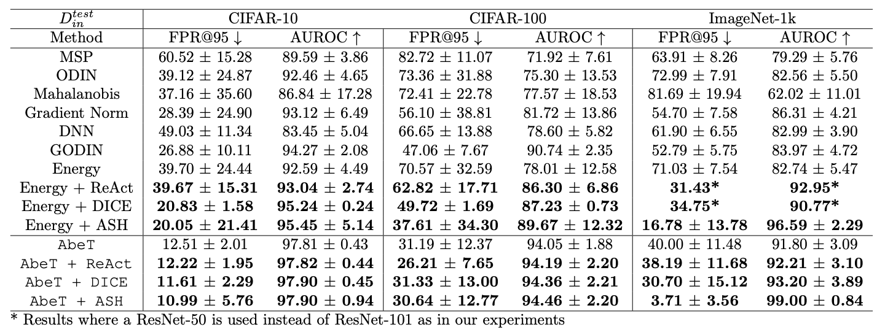

# Ablated Learned Temperature Energy (AbeT)
This code is modified from the [Gradient Norm OOD repository](https://github.com/deeplearning-wisc/gradnorm_ood)

This work combines the [Energy Score](https://arxiv.org/abs/2010.03759) with the Learned Temperature from [GODIN](https://arxiv.org/abs/2002.11297) and ablates one term.

# Usage
## 1. Dataset Preparation
### In-distribution dataset
Please download [ImageNet-1k](http://www.image-net.org/challenges/LSVRC/2012/index) and place it in
`./data/ImageNet/ILSVRC`.

All remaining ID datasets for CIFAR10/100 evaluations are automatically downloaded in our script to `./data`

### Out-of-Distribution data
Following [MOS](https://arxiv.org/pdf/2105.01879.pdf), we use the following 4 OOD datasets for evaluation for ImageNet-1k:
[iNaturalist](https://arxiv.org/pdf/1707.06642.pdf), 
[SUN](https://vision.princeton.edu/projects/2010/SUN/paper.pdf), 
[Places](http://places2.csail.mit.edu/PAMI_places.pdf), 
and [Textures](https://arxiv.org/pdf/1311.3618.pdf).

For iNaturalist, SUN, and Places, we have sampled 10,000 images from the selected concepts for each dataset,
which can be download from the following links:
```bash
wget http://pages.cs.wisc.edu/~huangrui/imagenet_ood_dataset/iNaturalist.tar.gz
wget http://pages.cs.wisc.edu/~huangrui/imagenet_ood_dataset/SUN.tar.gz
wget http://pages.cs.wisc.edu/~huangrui/imagenet_ood_dataset/Places.tar.gz
```

For Textures, we use the entire dataset, which can be downloaded from their
[official website](https://www.robots.ox.ac.uk/~vgg/data/dtd/).

Please put all downloaded OOD datasets into `./data`.
For more details about these OOD datasets, please check out the [MOS paper](https://arxiv.org/pdf/2105.01879.pdf).

All remaining OOD datasets for CIFAR10/100 evaluations are automatically downloaded in our script to `./data`

## 2. Installation
The following will create and activate a conda environment.
```
conda env create -f environment.yml
conda activate abet
```

## 3. Model Training

To train a model, please run:
```
python main.py --save-model-path <path you would like to save model weights to> --architecture <"resnet20" for CIFAR10/100 and "resnet101" for ImageNet-1k> --out-dataset <OOD dataset> --in-dataset <ID dataset>
```
For reproducibility purposes, we host our pre-trained models in [a common Google Drive folder](https://drive.google.com/drive/folders/1foWuTJX_JmiGF7vPRTxlui4TMr7fa9EJ?usp=sharing).
All AbeT results use the models with the `_learned_temperature.pth` postfix - as our method requires the use of a learned temperature.

## 4. OOD Detection Evaluation
To evaluate a model using AbeT, please run:
```
python main.py --load-model-path <path to model weights you would like to load> --architecture <"resnet20" for CIFAR10/100 and "resnet101" for ImageNet-1k> --out-dataset <OOD dataset> --in-dataset <ID dataset> --no-train --inference-mode ablated_energy
```
If you would like to reproduce Figure 1, run this with the flag `--hist` and the result will be saved to the `pngs` directory under the name `<OOD dataset name>_<ID dataset name>_histogram.png`.

If you would like to reproduce Figure 2, run this with the flag `--tsne` and the result will be saved to the `pngs` directory under the name `<OOD dataset name>_<ID dataset name>_tsne.png`.

# OOD Detection Results

AbeT achieves state-of-the-art performance averaged on all standard OOD datasets in classification. Changes from our submission to ICML on OpenReview are bolded, rather than the best results.



For more information about our Segmentation and Object Detection results, please see the `segmentation` and `object_detection` 
